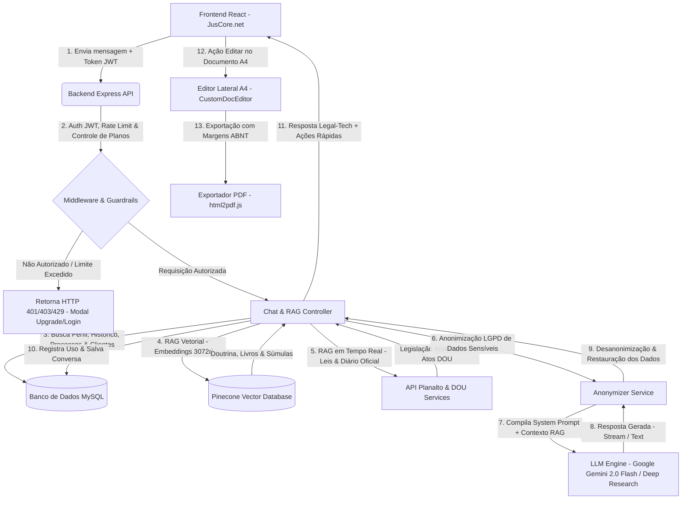

# ⚖️ JusCore.net v1.6.5 (Legal-Tech SaaS)

Plataforma SaaS de Inteligência Artificial Jurídica de alta performance para advogados, estudantes de Direito e pesquisadores jurídicos no Brasil.

---

## 🌟 Visão Geral & Arquitetura

O **JusCore.net** combina uma interface **Editorial Escura (Dark Mode)** minimalista e responsiva com um ecossistema RAG (Retrieval-Augmented Generation) de alto desempenho integrado ao **Pinecone Serverless** e **Google Gemini**.

### 🛠️ Stack Tecnológica

- **Frontend**: React, React Router (`App.jsx`), Tailwind CSS, Lucide Icons & Ativos Institucionais SVG.
- **Editor Físico A4**: Interface split-screen 50/50 no desktop com editor A4 integrado para formatação ABNT em tempo real.
- **Backend**: Node.js, Express, MySQL / Sequelize ORM, JWT Auth, Asaas Payment Gateway Integration.
- **Engine RAG & Vetorial**: Pinecone Serverless (AWS), embeddings via `gemini-embedding-001` (3072 dimensões).
- **Vídeo Promocional & Marketing**: Remotion v4 (React 19 + TypeScript + Tailwind CSS v4) com suporte a narrações e síntese de áudio.
- **Exportação & Documentos**: Suporte a exportação PDF ABNT com `html2pdf.js`.

### 📐 Fluxo de Arquitetura & Execução (Pipeline RAG)



---

## 🚀 Funcionalidades Principais (v1.6.5)

### 1. 💬 Workspace Bilateral Split-Screen (Chat + Editor A4)
- **Chat Jurídico Contextual**: Chat sem balões genéricos, alinhado à estética editorial jurídica.
- **Editor A4 em Tempo Real**: Folha física A4 com margens ABNT (3cm sup/esq, 2cm inf/dir) e fonte Times New Roman.
- **Integração Direta**: Botão "Editar no Documento A4" para transferir peças e pesquisas da IA diretamente ao editor.

### 2. 🏛️ Simulador OAB (Segunda Fase)
- Avaliação automatizada de peças práticas e questões discursivas baseadas no gabarito oficial da FGV.
- Transição interativa com notas progressivas, gráfico de desempenho e feedback detalhado por critérios.

### 3. 🎓 Assistente de TCC & Pesquisa Científica
- Estruturação de capítulos, citações NBR 10520 e bibliografia NBR 6023.
- Busca jurisprudencial e doutrinária integrada para teses de graduação e pós-graduação.

### 4. 🧮 Calculadoras Jurídicas & Ferramentas Públicas
- Cálculo de prazos processuais (CPC/CPP/CLT), honorários advocatícios e atualização monetária.
- Rotas públicas demonstrativas para captura de leads e testes interativos.

### 5. 🎬 Módulo Remotion & Automação de Marketing
- Projetos em `remotion/` para renderização de vídeos institucionais, reels para redes sociais e apresentações do produto.

---

## 📁 Estrutura do Repositório

```
v1.6.5_anty/
├── backend/                  # Servidor Express, Rotas API, Services & RAG
│   ├── prompts/              # System Prompts & Regras de Personas
│   ├── routes/               # Endpoints REST (auth, chat, admin, public, etc.)
│   ├── services/             # Gemini AI, Pinecone Vector DB, RAG Engine
│   └── scripts/              # Migrações e indexação de acervo jurídico
├── frontend/                 # Aplicação React SPA Principal
│   ├── src/
│   │   ├── components/       # Layout (Header, Sidebar, CustomDocEditor) & UI
│   │   ├── pages/            # Landing, Chat, OAB Simulator, TCC, Calculadoras
│   │   ├── context/          # AuthContext, ThemeContext (Fixed Dark Mode)
│   │   └── hooks/            # Hooks customizados (useChat, etc.)
│   └── public/               # Ativos institucionais e favicons
├── remotion/                 # Módulo de Vídeo e Animações Remotion v4
│   ├── src/                  # Composições de vídeo (JuscoreIntro, OabPovReels, etc.)
│   └── marketing/            # Scripts de automação de marketing e narração
├── documentation/            # Especificações de funcionalidades, planos e arquitetura
└── .agents/                  # Memória técnica e skills personalizadas do agente
```

---

## 🔒 Segurança & Privacidade

- **Variáveis de Ambiente**: Arquivos `.env`, credenciais VPS e chaves privadas estão estritamente excluídos pelo `.gitignore`.
- **Sanitização de Código**: Scripts temporários de manutenção (`scratch/`), arquivos de análise (`graphify-out/`), ambientes virtuais (`.venv/`) e caches (`__pycache__/`) não são rastreados.
- **Autenticação**: Hash de senha via `bcrypt` e tokens `JWT` para controle de sessão.

---

## ⚡ Guia Rápido de Execução

### Backend
```bash
cd backend
npm install
npm start
```

### Frontend
```bash
cd frontend
npm install
npm run dev
```

---

**JusCore.net v1.6.5** | *Tecnologia e Inteligência Artificial para o Direito Brasileiro*